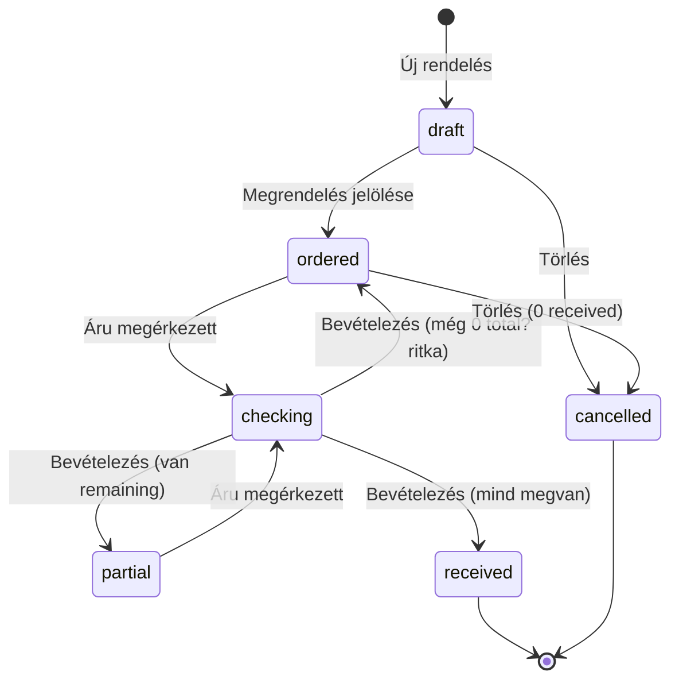
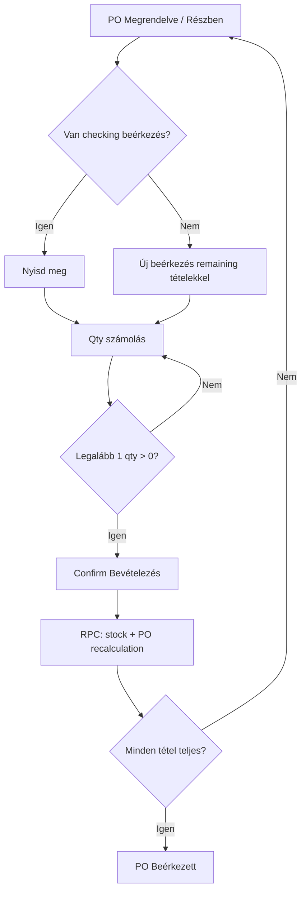

# 24 — Beszerzés workflow (forrásigazság)

**Státusz:** workflow spec — implementáció előtt kötelező olvasmány.  
**Scope:** Beszállítók · Beszállító rendelések · Beérkezések (UI név; DB: `shipments`).  
**Legacy:** `main-app` csak ötlet — nincs kódmegosztás (`08`).  
**UX:** certainty-first (`03`), magyar copy (`06`), lista limit 25 (`05`/`22`).

---

## 0. Egy mondatos modell

> **Kitől** veszünk → **mit rendelünk** → **mi jött meg** → **készlet nő**.

Három fogalom, négy PO-státusz, egy irreversible bevételezés. Minden edge case erre ül.

---

## 1. Fogalmak (kanonikus szótár)

| Fogalom | UI név | DB / belső | Mit jelent |
|---|---|---|---|
| Vendor | **Beszállító** | `suppliers` (+ címek, kapcsolatok) | Kitől rendelünk |
| Purchase Order | **Beszállító rendelés** | `purchase_orders` + `_items` | Kereskedelmi ígéret: mit kértünk, milyen áron |
| Goods receipt | **Beérkezés** | `shipments` + `shipment_items` | Fizikai esemény: egy doboz/raklap számolása |
| Stock in | **Bevételezés** | `stock_movements` (`in` / `purchase_receipt`) | Irreverzibilis készletnövelés |
| On order | **Úton / megrendelve** | PO `ordered` tételek − beérkezett | Termékoldalon látható „várható” qty (MVP+ ) |

**Tilos UI-ban:** „Shipment”, „PO”, „ASN”, „GRN” magyarázat nélkül.  
**„Szállítmány”** kerülendő a menüben (kimenőre is emlékeztet) → **Beérkezések**.

---

## 2. Optimalizált happy path (napi út)

```
1. Beszállító kiválasztása / létrehozása
2. Új rendelés → tételek (qty, nettó ár, egység)
3. Mentés = Vázlat
4. [Megrendelés jelölése]  ← telefon / webshop / e-mail után
5. (opcionális) [E-mail küldése] PDF-fel — esemény, nem státusz
6. … várás …
7. [Áru megérkezett] a rendelésről
      → háttérben draft Beérkezés + még hiányzó tételek prefill
8. Mennyiségek: barcode / +/- / kézi
9. [Bevételezés] → stock_movements + PO státusz újraszámolás
10. Ha még hiányzik → PO = Részben beérkezett; újra 7.
    Ha minden megvan → PO = Beérkezett
```

### Primary CTA szabály (egy / képernyő)

| Képernyő | Primary |
|---|---|
| Beszállítók lista | Új beszállító |
| Rendelések lista | Új rendelés |
| Rendelés (vázlat) | Megrendelés jelölése |
| Rendelés (megrendelve / részben) | **Áru megérkezett** |
| Beérkezés (ellenőrzés) | **Bevételezés** |
| Beérkezés (kész) | — (csak olvasás + címke) |

**Optimalizálás a main-apphoz képest:** nincs külön „Szállítmány létrehozása” gomb + confirm. Az **Áru megérkezett** = create-or-open draft beérkezés (idempotens).

---

## 3. Státuszgépek

### 3.1 Rendelés (`purchase_orders.status`)

| Kulcs | Label | Szerkeszthető? | Következő |
|---|---|---|---|
| `draft` | Vázlat | Igen (header + tételek) | → `ordered`, → `cancelled` |
| `ordered` | Megrendelve | Nem (csak note / expected_date?) | → beérkezés; → `partial` / `received`; → `cancelled` ha nincs bevételezett qty |
| `partial` | Részben beérkezett | Nem | → további beérkezés; → `received` |
| `received` | Beérkezett | Nem | Végállapot (javítás = új korrekciós mozgás, későbbi fázis) |
| `cancelled` | Törölve | Nem | Végállapot |

**Átnevezés main-apphoz képest:** `confirmed` → **`ordered`** (UI: Megrendelve). A „confirmed” félrevezető (ki igazolta?).

**Számított státusz (soha ne kézzel):**

```
received_qty(item) = SUM(shipment_items.quantity_received)
  WHERE shipment.status = 'received' AND not deleted

PO = received  ⟺ minden itemre received_qty >= ordered_qty
PO = partial   ⟺ van received_qty > 0 ÉS nem mind teljes
PO = ordered   ⟺ ordered státuszban volt ÉS received_qty mind 0
```

> **Megjegyzés:** a legacy `receive_shipment` RPC már N shipment alapján számol — a main-app API viszont **1 shipment/PO**-t kényszerített. Modul-appban **N beérkezés / PO kötelező**.

### 3.2 Beérkezés (`shipments.status`)

| Kulcs | Label | Jelentés |
|---|---|---|
| `checking` | Ellenőrzés | Számolás folyamatban (main-app: `draft`) |
| `received` | Bevételezve | Stock mozgások létrejöttek |
| `cancelled` | Törölve | Soft-delete / megszakítva; qty nem számít a PO-ba |

**Átnevezés:** UI „Ellenőrzés”, belső kulcs `checking` (vagy marad `draft` — döntés implementációkor; UI label a fontos).

---

## 4. Oldalak és IA

### Nav csoport: **Beszerzés**

1. Beszállítók  
2. Beszállító rendelések  
3. Beérkezések  

Addon / entitlement: **`beszerzes`** feature az **Alap plan** része (`20260517_packages_beszerzes_alap_pos_addon.sql`; korábbi 0 Ft add-on kikapcsolva). Termék detail készlet szekció csak ha entitled. Scanner entitlement: barcode a beérkezésen, ha van.

### 4.1 Beszállítók

- **Implementálva:** `/beszallitok` — lista + űrlap (`20260501_suppliers.sql`).
- Táblák: `suppliers`, `supplier_addresses`, `supplier_contacts`.
- Lista: név, telefon, e-mail, város (default cím), státusz; kereső + active/inactive.
- Űrlap szekciók: Alap · Adó · Pénzügy defaultok · Címek · Kapcsolattartók · Megjegyzés.
- Soft delete; inaktívra új PO később tiltott (`A10`).
- Kötelező mentéskor: csak **cégnév**.
- Detail: lásd mezőlista a migrációban / `lib/suppliers/parse.ts`.

### 4.2 Beszállító rendelések

- **Implementálva (MVP):** `/beszallitoi-rendelesek` — lista + buying workspace (`20260502_purchase_orders.sql`).
- Csak **Termékek** (`accessories`); duplikált tétel → qty összevonás.
- Státusz: `draft → ordered` (partial/received a beérkezés fázisban).
- Primary: Mentés / **Megrendelés jelölése**; Áru megérkezett → következő modul.
- PO szám: `BR-YYYY-NNN`.
- **Célraktár:** draft-on választható (≥2 aktív WH); 1 WH → rejtett, default. Ordered+ readonly. Beérkezés örökli; checking-en override (multi).
- **PO detail (post-receive):** nem-draft tételeknél **Beérkezett / Hiányzik / Állapot** (Teljes · Részleges · Vár · Többlet); fejléc + lábléc `kapott / rendelt · %`; **Beérkezések** szekció linkekkel (`/beerkezesek/[id]`); checking gyorslink; hiányos lezárás jelzés.

Lista oszlopok (sűrű, Midday): szám, beszállító, státusz (szín+szöveg), várható érkezés, tételek db, nettó.

Szűrők: státusz chip-ek + kereső (szám / beszállító). Default sort: `updated_at desc`.

### 4.3 Beérkezések

- **Implementálva:** `/beerkezesek` — lista + detail (`20260504_goods_receipts_and_stock.sql`). Lásd [26-beerkezesek.md](26-beerkezesek.md).
- Lista: szám, PO szám, beszállító, státusz, dátum, tételek.
- Empty: „Még nincs beérkezés. Nyiss egy rendelést, és kattints az Áru megérkezett gombra.”
- PO `ordered`/`partial` primary CTA: **Áru megérkezett** → create-or-open.

---

## 5. Részletes lépések

### 5.1 Új rendelés

1. Beszállító kötelező (kereső, nem szabad szöveg).
2. Raktár: **Célraktár** a PO fejlécen (≥2 aktív → MenuSelect; 1 → rejtett default). Lásd [25-warehouses.md](25-warehouses.md). Beérkezés örökli; checking-en multi override.
3. Várható érkezés: opcionális dátum (lista sort / „késik” jelzéshez fontos).
4. Tételek: termékkereső (SKU / név / barcode) → qty → nettó egységár → ÁFA / egység default a termékből.
5. Üres tétel lista → Mentés tiltott.
6. Mentés → `draft`, generált `po_number` (tenant-szekvencia).

### 5.2 Megrendelés jelölése

- Csak `draft` + ≥1 tétel + qty > 0.
- Confirm dialógus (destruktív nem, de irreverzibilis szerkesztéshez):  
  „A rendelés ezután nem szerkeszthető. Megrendelted a beszállítónál?”  
  Primary: **Megrendelés jelölése** · Default fókusz / Mégse: **Mégse**.
- Hatás: `ordered`; tételek lock; „úton” qty (ha van készlet UI).

### 5.3 E-mail (opcionális)

- Nem státusz. `email_sent` + `email_sent_at` + audit.
- PDF a rendelésről; user küldi / app SMTP.
- Sikertelen küldés ≠ rollback a `ordered`-re.

### 5.4 Áru megérkezett (create-or-open)

**Input:** PO `ordered` vagy `partial`.

**Algoritmus:**

```
IF létezik draft/checking beérkezés ehhez a PO-hoz:
  → nyisd meg azt (ne hozz létre másodikat)
ELSE:
  → új beérkezés
  → tételek = PO itemek ahol remaining_qty > 0
     remaining = ordered_qty - SUM(received shipments)
  → quantity_received kezdő = 0 (user számol)
  → target_quantity = remaining
```

**Tiltott:**

- `draft` PO-ról (előbb jelöld megrendelve).
- `received` / `cancelled` PO.
- Második párhuzamos `checking` ugyanarra a PO-ra (lásd edge case E12).

### 5.5 Ellenőrzés (beérkezés detail)

- Barcode fókusz (ha scanner / desktop).
- Sor: termék · cél qty · kapott qty (+/−) · eltérés szín+szöveg.
- 0 kapott = a sor kimarad a bevételezésből (nem hiba).
- Legalább 1 sor qty > 0 a Bevételezéshez.
- Overage (kapott > cél): **figyelmeztetés**, default **engedélyezett** soft limittel (pl. +10% vagy abszolút; tenant setting később). Első MVP: engedélyez + narancs hint.
- Underage: OK (partial).

### 5.6 Bevételezés (irreverzibilis)

1. Confirm: „X tétel, Y db kerül a készletre. Ez nem vonható vissza.”
2. Tranzakció / RPC:
   - shipment → `received`
   - `stock_movements` minden qty > 0 sorra
   - PO státusz újraszámolás (3.1)
   - opcionális: dolgozó(k) audit (`receipt_workers`) — MVP: aktuális user elég; multi-worker később
3. Toast jobb alul: „Bevételezve. Rendelés: Részben beérkezett | Beérkezett.”
4. Címke nyomtatás secondary (ha `product_labels` entitlement — Alap plan).

### 5.7 Termék „kész / elérhető”

Bevételezés után:

- Készletszám nő a raktáron.
- Ha a termék `on_stock` / rendelős flag: **nem** kell automatikusan `on_stock=true`-ra állítani MVP-ben (külön termékmező); a készlet > 0 = elérhető.
- Ügyfélrendelés / lapszabászat link (PO item ↔ customer order item): **fázis 2** — MVP core beszerzés nem függ tőle.

---

## 6. Edge case katalógus (teljes)

Jelölés: **MVP** = első release kezeli · **P2** = következő · **Később** = whale / accounting.

### A. Rendelés életciklus

| ID | Edge case | Döntés |
|---|---|---|
| A1 | Üres tételű mentés | Tiltott |
| A2 | Qty = 0 tétel | Tiltott mentéskor |
| A3 | Negatív qty / ár | Tiltott |
| A4 | Dupla mentés / double-click Megrendelés | Idempotens: ha már `ordered`, 200 + no-op |
| A5 | `ordered` után tétel módosítás | Tiltott; új PO kell, vagy `cancelled` + új (ha még 0 received) |
| A6 | `ordered` + 0 beérkezés → visszahívás | Engedélyezett: → `cancelled` (nem vissza `draft`-ba — audit) |
| A7 | `partial` / `received` törlés | Tiltott. Korrekció = P2 stock adjustment |
| A8 | Soft-delete draft | Hard vagy soft OK; lista nem mutatja |
| A9 | PO szám ütközés | Tenant-szekvencia + unique; retry |
| A10 | Inaktív beszállító új PO | Tiltott |
| A11 | Beszállító váltás draftban | Engedélyezett; ordered után tiltott |
| A12 | Várható dátum a múltban | Engedélyezett + „késik” hint listán |
| A13 | Valuta / ÁFA változás termék törzsben ordered után | PO snapshot árak maradnak; törzs nem írja felül |
| A14 | Termék törlése / soft-delete miközben PO nyitott | PO sor megmarad (snapshot név+sku); új tételhez nem választható |
| A15 | Párhuzamos szerkesztés ugyanazon draft | `updated_at` / version; 409 + „Valaki módosította” (`12`) |

### B. Beérkezés / részszállítás

| ID | Edge case | Döntés |
|---|---|---|
| B1 | 1 PO → N beérkezés | **Kötelező** (main-app 1:1 API hibás volt) |
| B2 | 2. draft beérkezés ugyanarra a PO-ra | Tiltott — open existing (E12) |
| B3 | Partial: csak 2/5 tétel jön | Bevételezés OK; PO `partial`; következő Áru megérkezett a remaininggel |
| B4 | Tétel teljesen megjött, másik 0 | OK |
| B5 | Kapott > rendelt (overage) | Figyelmeztetés; MVP allow; stock a kapott qty |
| B6 | Kapott = 0 minden sor | Bevételezés tiltott |
| B7 | Extra tétel ami nincs a PO-n | **P2 mag:** dialóg „Hozzáadás PO-n kívül” (`is_extra`); stock nő; PO kalkból kimarad |
| B8 | Beérkezés közben PO cancelled | Receive tiltott; checking → cancelled |
| B9 | Bevételezett beérkezés törlése | Tiltott (stock már bent) |
| B10 | Checking beérkezés elhagyása | Marad `checking`; listán „Félbehagyott” |
| B11 | Checking törlése | Engedélyezett ha nincs stock_movement; soft-delete |
| B12 | Dupla Bevételezés gomb | RPC: csak `checking` → `received`; 2. hívás hiba / idempotens success |
| B13 | Összes remaining 0, de PO még nem received (race) | Áru megérkezett → toast „Minden tétel beérkezett”; PO status refresh |
| B14 | Több raktár | MVP: `warehouses` + 1 default (`25`). P2: beérkezésen választható dest warehouse + channel map |
| B15 | Beérkezés dátuma ≠ mai nap | Opcionális `received_at` override később; MVP = now() |
| B16 | Hiányos lezárás (többet nem várunk) | PO gomb **Rendelés lezárása (hiányos)** → `received` + `closed_incomplete_at` |

### C. Készlet és termék

| ID | Edge case | Döntés |
|---|---|---|
| C1 | Bevételezés stock_movement fail félig | Egy tranzakció — all or nothing |
| C2 | Egységátváltás (lap m², szálas fm) | Ha lapszabászat termék: qty kalkuláció a receive RPC-ben (main-app minta). Egyszerű termék: raw qty |
| C3 | Készlet 0 → pozitív | Termék listán elérhető; nincs auto status machine a terméken MVP-ben |
| C4 | Negatív készlet más modulból | Receive mindig `in`; nem kompenzál |
| C5 | Ár eltérés beérkezéskor (számla ≠ PO) | MVP: PO ár snapshot a mozgáson; P2 landed cost / variance |
| C6 | Címke qty ≠ received | User állítja a print dialógban; default = received |

### D. Kommunikáció / külső

| ID | Edge case | Döntés |
|---|---|---|
| D1 | E-mail sikertelen | Toast hiba; `ordered` marad; újrapróbál |
| D2 | Webshop / telefon rendelés | Nincs integráció MVP — user jelöli Megrendelve |
| D3 | Beszállító ASN / tracking szám | P2 mező a beérkezésen |
| D4 | PDF nyomtatás offline | `15` print rules; helyi nyomtató |

### E. Jogosultság / tenancy / konkurencia

| ID | Edge case | Döntés |
|---|---|---|
| E1 | Másik tenant adatai | RLS kötelező (`17`) |
| E2 | Nincs beszerzés entitlement | Nav rejtve; API 403 |
| E3 | Csak olvasó role | Lista/detail OK; CTA rejtve |
| E4 | Impersonation | Audit: ki végezte a receive-t |
| E5 | Session lejár receive közben | Mentett checking qty-k DB-ben; újra login után folytatható |
| E12 | Két user egyszerre „Áru megérkezett” | Unique partial index: max 1 `checking` / PO; 2. kapja a meglévőt vagy 409 |

### F. UX / emberi hibák

| ID | Edge case | Döntés |
|---|---|---|
| F1 | Véletlen Megrendelés jelölése | Confirm + ha 0 received → cancelled |
| F2 | Véletlen Bevételezés | Confirm szöveg qty összeggel; P2: 5 perces undo **nincs** (stock) — inkább erős confirm |
| F3 | Barcode ismeretlen | Ha nincs törzsben: toast. Ha van: dialóg PO-n kívüli hozzáadáshoz |
| F4 | Barcode más PO termékére | Dialóg → explicit Hozzáadás PO-n kívül (nem csendes) |
| F5 | Telefonos félbeszakítás | Checking autosave qty on blur / debounce 500ms |
| F6 | 15 éves teszt | Látja-e a következő gombot? Ha nem → IA fail |

### G. Tudatosan NEM MVP

| Téma | Indok |
|---|---|
| 3-way match (PO–beérkezés–számla) | Könyvelés, nem raktár |
| RFQ / beszállítói árajánlat | Extra entitás |
| Auto-reorder / min készlet | Külön modul |
| Dropship | Nincs raktár-touch |
| Cross-dock / multi-bolt split | Reddit use-case; nem Turinova core |
| Beszállítói portál | Partner portal scope |
| Visszáru beszállítónak | P2 stock `out` + credit |

---

## 7. Main-app vs modul-app (optimalizálási diff)

| Terület | main-app | modul-app (ez a doc) |
|---|---|---|
| UI név | Szállítmányok | **Beérkezések** |
| Létrehozás | Külön gomb + csak `confirmed` + **1 shipment/PO** | **Áru megérkezett** = create-or-open; **N / PO** |
| Státusz kulcs | `confirmed` | `ordered` |
| Shipment draft label | Várakozik | **Ellenőrzés** |
| Receive worker | Kötelező multi-worker | MVP: aktuális user; multi opcionális |
| Extra tétel scannel | Gyakran hozzáadható | MVP: csak PO sorok |
| Ügyfélrendelés sync | receive_shipment-ben | Fázis 2 |
| Stack | MUI | shadcn + docs 02/18 |

---

## 8. Adatmodell váz (implementációs szerződés)

```
suppliers / partners (is_supplier)
  └── purchase_orders
        status: draft|ordered|partial|received|cancelled
        po_number, expected_date, warehouse_id, email_sent*
        └── purchase_order_items
              product_id / refs, qty, net_price, vat_id, unit_id
              (snapshot: name, sku)
        └── shipments (beérkezések)
              status: checking|received|cancelled
              └── shipment_items
                    po_item_id, quantity_received, target_quantity?
              └── stock_movements (on receive)
                    movement_type=in, source=purchase_receipt
```

**Indexek / constraint (kötelező):**

- Unique `(tenant_id, po_number)`
- Partial unique: egy `checking` shipment / `purchase_order_id`
- RLS minden táblán
- Receive RPC: egy tranzakció, PO status recalculation N shipment alapján

**Lista query:** soha `select('*')`; default limit 25; status + search URL-ben.

---

## 9. Állapotmátrix — mikor mi szabad

| Művelet | draft | ordered | partial | received | cancelled |
|---|---|---|---|---|---|
| Szerkesztés tételek | ✓ | — | — | — | — |
| Megrendelés jelölése | ✓ | — | — | — | — |
| E-mail | ✓/✓ | ✓ | ✓ | ✓ | — |
| Áru megérkezett | — | ✓ | ✓ | — | — |
| Cancel PO | ✓ | ✓* | —** | — | — |
| Bevételezés (checking) | n/a | ✓ | ✓ | — | — |

\* csak ha Σ received = 0 és nincs `received` shipment  
\*\* partial cancel: Később (komplex); MVP tiltva

| Művelet | checking | received | cancelled |
|---|---|---|---|
| Qty szerkesztés | ✓ | — | — |
| Bevételezés | ✓ | — | — |
| Törlés / cancel | ✓ | — | — |
| Címke | ✓/✓ | ✓ | — |

---

## 10. Copy szótár (kötelező)

| Kulcs | Label |
|---|---|
| draft | Vázlat |
| ordered | Megrendelve |
| partial | Részben beérkezett |
| received (PO) | Beérkezett |
| cancelled | Törölve |
| checking | Ellenőrzés |
| received (shipment) | Bevételezve |
| CTA mark ordered | Megrendelés jelölése |
| CTA arrive | Áru megérkezett |
| CTA receive | Bevételezés |
| CTA new PO | Új rendelés |
| CTA new supplier | Új beszállító |

Hibák: `06` séma (mi / miért / mit tegyen).  
Példa overage: „Több érkezett, mint a rendelés (12 / 10). Bevételezheted — a készlet a kapott mennyiséggel nő.”

---

## 11. Mermaid — kanonikus flow





---

## 12. Elfogadási kritériumok (workflow szint)

1. Új user 5 perc alatt végigmegy: beszállító → rendelés → megrendelés → beérkezés → készlet nő.  
2. Részszállítás: 2 beérkezés ugyanarra a PO-ra, helyes `partial` → `received`.  
3. Nincs második párhuzamos checking ugyanarra a PO-ra.  
4. Bevételezett beérkezés nem törölhető.  
5. Ordered PO tételei nem szerkeszthetők.  
6. Lista ≤25, URL szűrő, nincs `select('*')`.  
7. Egy primary CTA / képernyő; sorakciók láthatók.  
8. Státusz mindig szín + magyar szöveg.  
9. Receive all-or-nothing (nincs félkész stock).  
10. Legacy main-appból **0** importolt fájl.

---

## 13. Fázisok

| Fázis | Scope |
|---|---|
| **MVP** | Beszállítók + PO + raktárak + beérkezések + stock in (accessories) — implementálva |
| **P2** | Termék detail készlet szekció (addon-gated) — kész; overage policy, ASN, landed cost, ügyfélrendelés link, multi-worker, channel map |
| **P3** | Visszáru, 3-way match, auto-reorder, beszállítói portál |

---

## 14. Kapcsolódó docok

- `03-ux-certainty-first.md` — CTA, confirm, certainty  
- `06-copy-hungarian.md` — szótár bővítés  
- `09-keyboard-and-data-entry.md` — scanner / paste  
- `12-offline-conflict-and-recovery.md` — 409, draft autosave  
- `13-numbers-units-formats.md` — pénz, qty  
- `15-print-and-documents.md` — PDF / címke  
- `17-saas-architecture.md` — RLS, tenant  
- `22-performance-playbook.md` — lista / RPC  

---

## 15. Zárolt döntések (összefoglaló)

1. UI: **Beérkezések**, nem Szállítmányok.  
2. Primary path: **Áru megérkezett** a PO-ról (create-or-open).  
3. **N beérkezés / 1 PO**; max 1 checking egyszerre.  
4. Státusz: `draft → ordered → partial → received`.  
5. Receive irreverzibilis; cancel csak 0 received mellett.  
6. Overage: figyelmeztetés + allow (MVP).  
7. Extra (PO-n kívüli) tétel: tiltott MVP.  
8. E-mail = esemény, nem státusz.  
9. Számla / 3-way match / auto-reorder: nem MVP.  
10. main-app = ötlet only.
